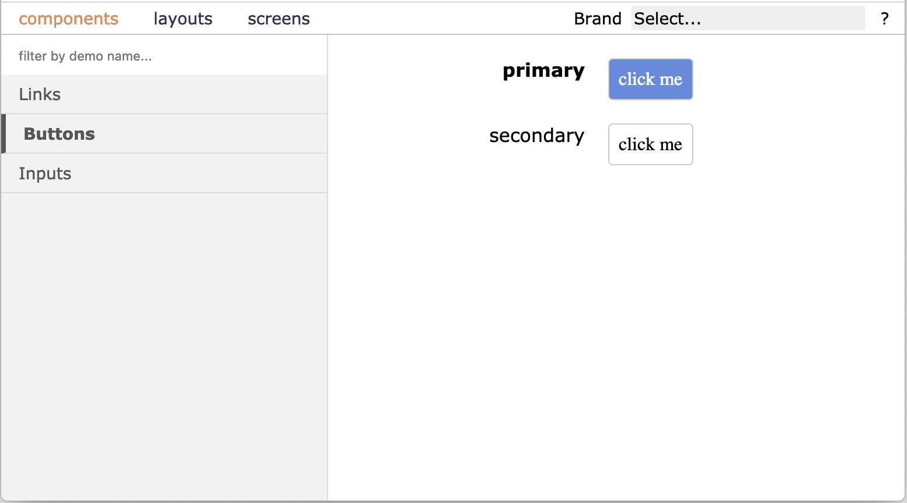

# Intro

```typescript
import { ComponentViewer } from 'react-component-viewer';
```



React Component to help you with development of other React components.
* just a component, no separate build system,
* observe component states all at once or zoom into a single component or a screen for debugging,
* user defined theme switching for multi brand/theme development. 

# Installation

```
npm install react-component-viewer --save-dev 
```

# CRA Example

```typescript
import * as React from 'react';

import { Registries, ComponentViewer } from 'react-component-viewer';

import { buttonsDemo } from './demos/buttons';
import { linksDemo } from './demos/links';
import { profileScreenDemo } from './demos/profileScreen';
import { formsDemo } from './demos/forms';
import { sideBySideDemo } from './demos/sideBySide';

const registries = new Registries({componentWrapper: DemoWrapper});
registries.add('components')
    .registerAsGrid('Links', 300, linksDemo)
    .registerAsTwoColumnTable('Buttons', buttonsDemo)
    .registerAsRows('Inputs', inputsDemo);

registries.add('layouts')
    .registerAsRows('Side by Side', sideBySideDemo);

registries.add('screens')
    .registerSingle('Single Screen', profileScreenDemo)
    .registerAsMiniApp('Single Screen mini app', '/app', profileScreenDemo);

export class App extends React.Component {
    render() {
        return (
            <ComponentViewer registries={registries}/>
        );
    }
}
```

# Read more

[More detailed explanation](https://medium.com/@mykolagolubyev/react-component-viewer-ff7cf793695a) 

